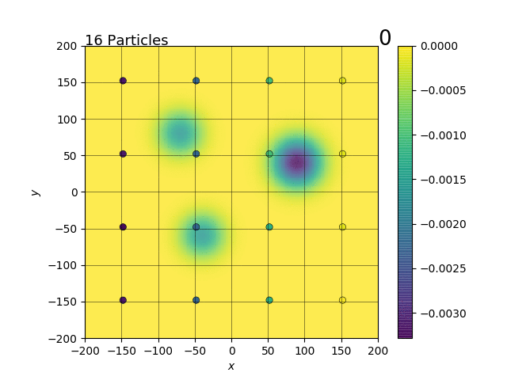
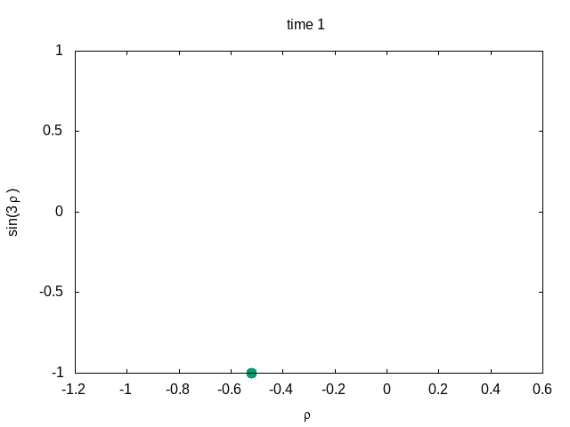

## Stochastic modeling exam repository

---

Implementation of the **Particle Swarm Optimization algorithm**, with the original version and some of its applications.

You can find:
- the class Particle which contains the values of the parameters for each particle (mainly position and velocity(
- the class PSO which impelements the general algorithm with the update of position and velocity in each step and the computation of Global and local best positions. It is then developed and used in three classes:
  - the class GBEST which implements the case where all particles communicate and only one global best position is kept
  - the class LBEST which implements the case where there are more global best positions depending on the neighborhood of each particle
  - the clas SA-PSO which implements the case where PSO is integrated with **simulated annealing**
- three main files used to run each of the three cases
- the code pso_p which contains the application of PSO to reinforcement learning by the creation of a **PSO-Policy** with implemented the mountain-car case
- the cass Anim used to create gifs

## Some Results:

* SA_PSO Particle Swarm Optimization algorithm

<figure>
  
</figure>

Reference: Horng-Lin Shieh, Cheng-Chien Kuo, Chin-Ming Chiang “Modified particle swarm optimization algorithm with simulated annealing behavior and its numerical verification”, Applied Mathematics and Computation 218 (2011) 4365–4383

* PSO_P mountain car

<figure>
  
</figure>

Reference: Hein at al, “Reinforcement Learning with Particle Swarm Optimization Policy (PSO-P) in Continuous State and Action Spaces” , International Journal of Swarm Intelligence Research, 2016.

